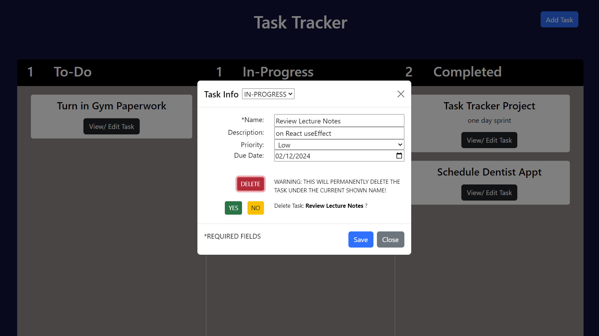

# Task Tracker &nbsp;&nbsp;

**Name:** Elizabeth Trotter

### Project Scope: 

This was a `single day sprint` challenge where I built out a `simple task tracking app` that allows you to enter tasks and track the progress. This was a `desktop build` that utilized `vanilla JavaScript`, `HTML`, and the `Bootstrap Framework`. Click [here](#desktop-preview) to see a preview of the task tracking app in action or check the status badge above to view the deployed website.

> [!NOTE]  
> The project focused on functionality first, meeting the client's requirements, and supplying a working product prior to the deadline. There is opportunity to improve the design and responsiveness, if desired. 

***Client Requirements:***
- [x] Have data saved
- [x] Be able to add tasks with various fields:
    - Task Name
    - Task Description
    - Task Status
        - ToDo
        - In Progress
        - Complete
    - Priority Status
        - Low
        - Medium
        - High
    - Due Date
- [x] Be able to edit tasks
- [x] When changing status the item should move to the appropriate spot without refreshing the page
- [x] Use creating elements
- [x] Must use import and export (see local storage js file)
- [x] Tested
- [x] Desktop build for this application

### Desktop Preview

Figure 1: Desktop preview of tracker in action while viewing / deleting a chosen task
